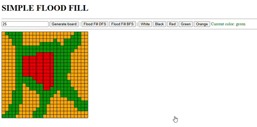

# Flood Fill Visualizer

This project is a simple flood fill visualizer implemented in JavaScript, HTML, and CSS. It allows users to interactively create a grid, paint cells, and apply flood fill algorithms using both Depth-First Search (DFS) and Breadth-First Search (BFS).
I was asked to develop this flood fill algorithm during an Amazon interview! I decided to visually develop both versions of the algorithm in order to have a deeper understanding on how they behave differently.

## Features
- **Interactive Grid Creation**: Users can generate a square grid of customizable size.
- **Cell Coloring**: Click and drag to paint cells with different colors.
- **Flood Fill Algorithms**:
  - **DFS (Depth-First Search) Flood Fill**
  - **BFS (Breadth-First Search) Flood Fill**
- **Visual Effects**: Animated flood fill with a delay for better visualization.

## Usage

1. **Clone the repository**:
   ```sh
   git clone https://github.com/stiven-hidri/floodfill.git
   cd flood-fill-visualizer
   ```

2. **Open `index.html` in a browser**.

3. **Generate a Grid**:
   - Enter the desired grid size in the input field.
   - Click the "Generate Board" button to create the grid.

4. **Paint the Grid**:
   - Select a color by clicking on a color picker button.
   - Click and drag on the grid to paint cells.

5. **Use Flood Fill**:
   - Click on "Flood Fill DFS" or "Flood Fill BFS" to activate the respective algorithm.
   - Click on a cell to start the flood fill process.

## Implementation Details
- **Flood Fill Algorithms**:
  - DFS uses a stack-based iterative approach. O(N × M)
  - BFS uses a queue-based iterative approach. O(N × M)

## Future Improvements
  - Too many LOL

## Demo

